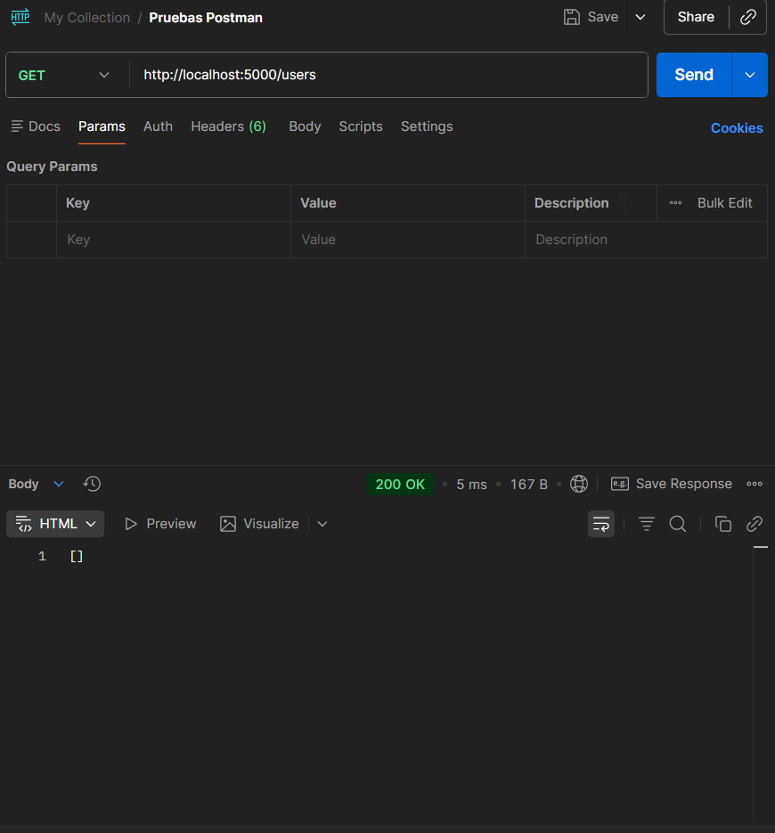
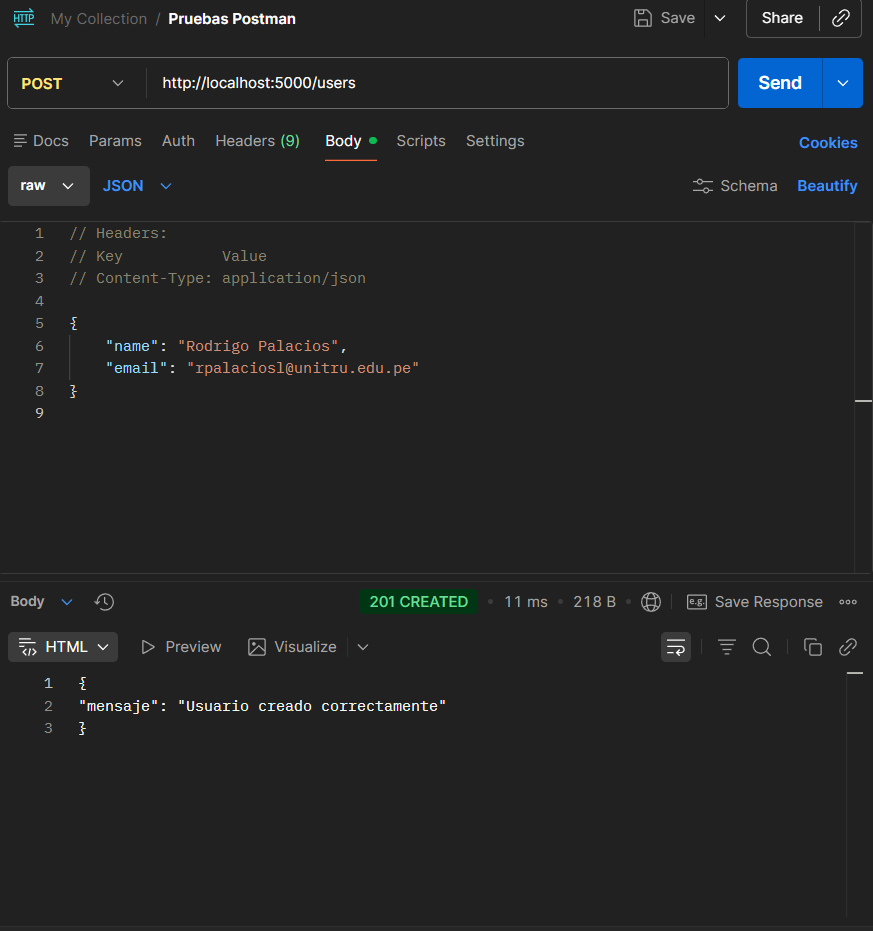
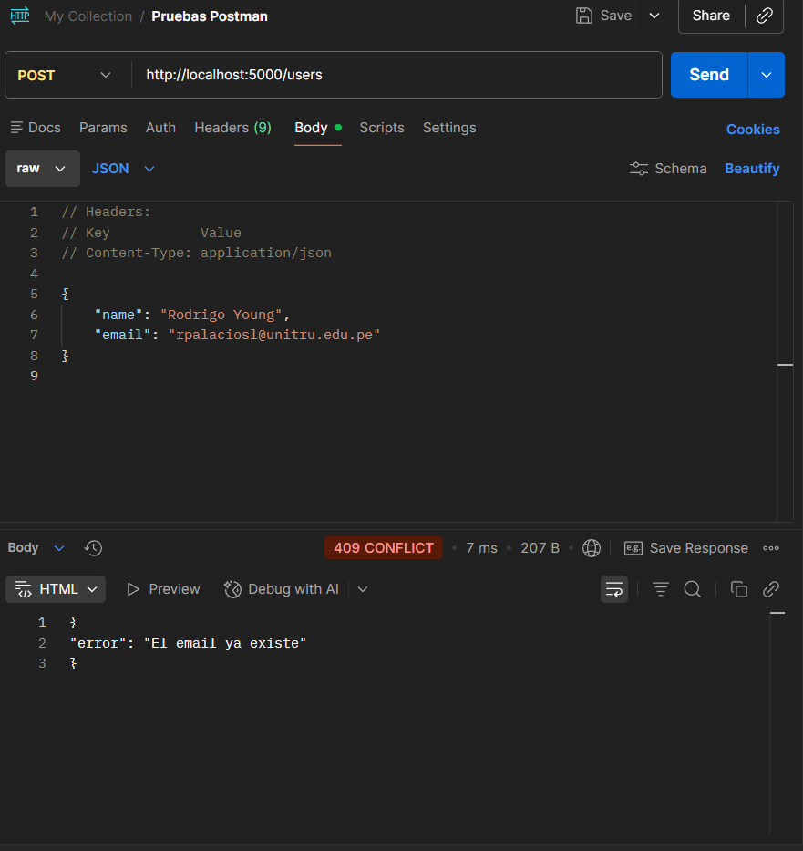
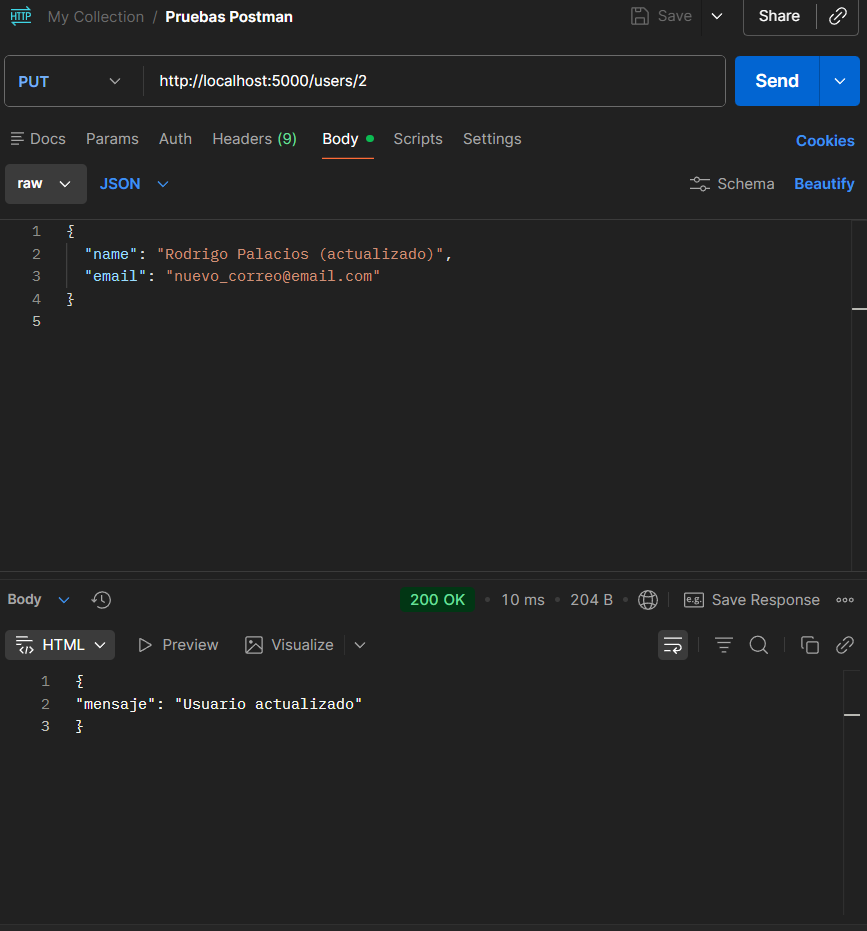
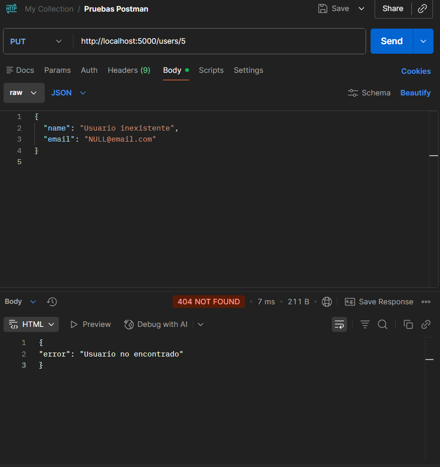
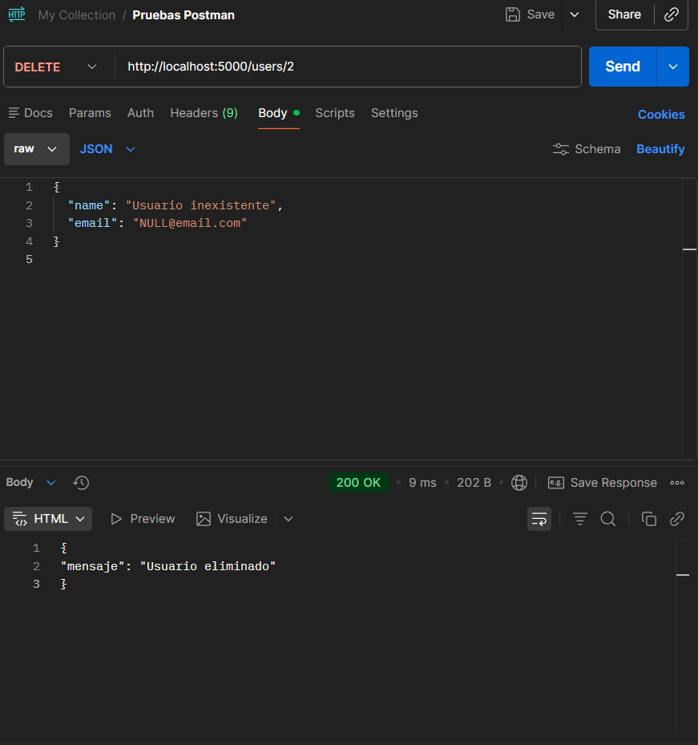
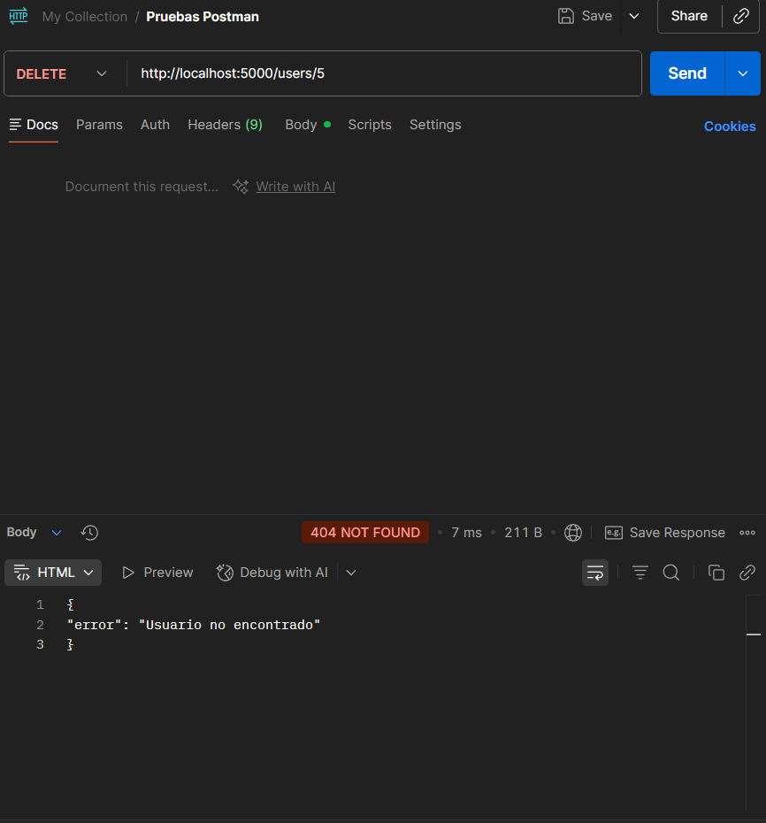

# API REST con Flask y SQLite

## Descripción del proyecto

Este proyecto consiste en el desarrollo de una **API REST** utilizando las bibliotecas de python **Flask** y **SQLite**, que permite realizar operaciones **CRUD** (Crear, Leer, Actualizar y Eliminar) sobre una tabla llamada **users**.  
La API sigue los principios REST, devuelve respuestas en formato JSON y maneja correctamente códigos de estado HTTP.

-------------------------------------------------

## Tecnologías utilizadas

- Python 3
- Flask
- SQLite
- Postman (para pruebas)

-------------------------------------------------

## Instalación y ejecución

### 1. Clonar o descargar el proyecto
Ubicarse en la carpeta del proyecto.

### 2. Instalar dependencias
```bash
pip install flask
```

La API se ejecuta en: http://localhost:5000

ENDPOINTS disponibles:

GET /users:
Obtiene la lista de usuarios registrados.
- Método: GET
- Respuesta: 200 OK
- Formato: JSON

POST /users:
Crea un nuevo usuario.
- Método: POST
- Body (JSON):
```json
{
  "name": "Nombre Apellido",
  "email": "nombre_apellido@email.com"
}
```
- Respuestas:
    - 201 Created → usuario creado
    - 400 Bad Request → datos faltantes
    - 409 Conflict → email duplicado

PUT /users/<id>:
Actualiza un usuario existente.
- Método: PUT
- Parámetro: id (entero)
- Body (JSON):
```json
{
  "name": "Nombre Actualizado",
  "email": "nombre2@email.com"
}
```
- Respuestas:
    - 200 OK → usuario actualizado
    - 404 Not Found → usuario inexistente

DELETE /users/<id>:
Elimina un usuario por su ID.
- étodo: DELETE
- Parámetro: id (entero)
- Respuestas:
    - 200 OK → usuario eliminado
    - 404 Not Found → usuario inexistente

-------------------------------------------------

## PRUEBAS CON POSTMAN

Las pruebas se realizaron utilizando Postman, verificando tanto casos correctos como incorrectos.

Pruebas realizadas:

- GET /users (lista inicial vacía):



- POST /users (usuario válido)



- POST /users (email duplicado)



- PUT /users con ID válido



- PUT /users con ID inexistente



- DELETE /users con ID válido



- DELETE /users con ID inexistente

